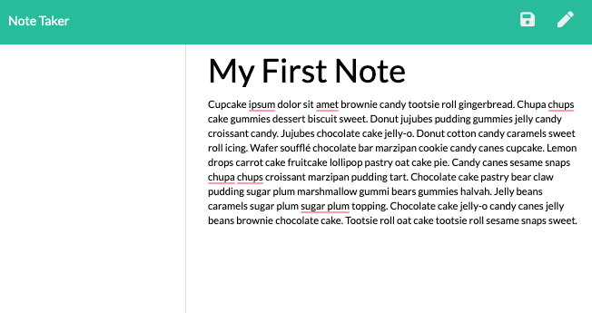

# Note-Taker-Express

\*[Description](#Description)

\*[Installation](#Installation)

\*[Usage](#Usage)

\*[Contributing](#Contributing)

\*[Testing](#Testing)

\*[License](#License)

## Description

This project utilizes Express.js to create an application that can be used to write, save, and delete notes. The note data is retrieved from a JSON file. This application is practical for a user who would like to organize their thoughts and keep track of tasks to complete.

This application allows users to create and save notes. A user can also view previously saved notes. Finally, a user can delete notes if they choose.

To view the final application, please use this link:

- https://sheltered-shore-14093.herokuapp.com/

# Installation

The code for the Note Taker Express Application can be found on github using the following link:

- https://github.com/shelbyandersen/Note-Taker-Express

# Usage

The Note Taker Express Application uses express.js, node.js, and fs. POSTMAN was utilized for testing the backend of the application.

The GET `/notes` path returns the `notes.html` file

The GET `*` path returns the `index.html` file

This application utilizes the `fs` module to retrieve notes from `db.json`

There are three API routes utilized in this application:

- GET (used to read the `db.json` file and return all saved notes as JSON)
- POST (used to receive a new note on the request body and add it to the `db.json` file and return the new note to the client)
- DELETE ( `/api/notes:id` receives a new parameter containing the id of a note to delete. The note is deleted based on the id)

The final application is deployed on Heroku.

# Contributing

The initial design of this application was provided by Trilogy Educational Services.

The application was completed by Shelby Andersen

# Testing

To test this application you can use the link here:

- https://sheltered-shore-14093.herokuapp.com/

# License

MIT License

Copyright (c) [2020] [Shelby Andersen]

Permission is hereby granted, free of charge, to any person obtaining a copy of this software and associated documentation files (the "Software"), to deal in the Software without restriction, including without limitation the rights to use, copy, modify, merge, publish, distribute, sublicense, and/or sell copies of the Software, and to permit persons to whom the Software is furnished to do so, subject to the following conditions: The above copyright notice and this permission notice shall be included in all copies or substantial portions of the Software.

THE SOFTWARE IS PROVIDED "AS IS", WITHOUT WARRANTY OF ANY KIND, EXPRESS OR IMPLIED, INCLUDING BUT NOT LIMITED TO THE WARRANTIES OF MERCHANTABILITY, FITNESS FOR A PARTICULAR PURPOSE AND NONINFRINGEMENT. IN NO EVENT SHALL THE AUTHORS OR COPYRIGHT HOLDERS BE LIABLE FOR ANY CLAIM, DAMAGES OR OTHER LIABILITY, WHETHER IN AN ACTION OF CONTRACT, TORT OR OTHERWISE, ARISING FROM, OUT OF OR IN CONNECTION WITH THE SOFTWARE OR THE USE OR OTHER DEALINGS IN THE SOFTWARE.

© 2020 Shelby Andersen in Collaboration with Georgia Tech Coding Boot Camp. All Rights Reserved.
